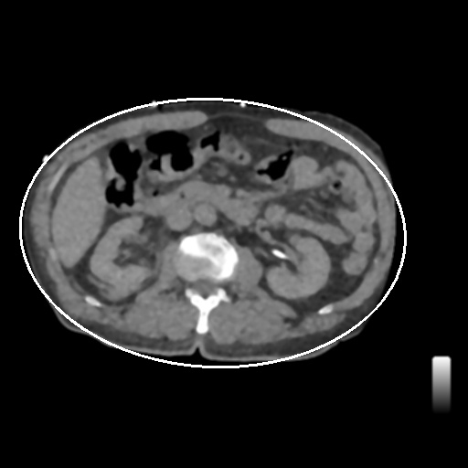
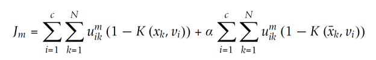
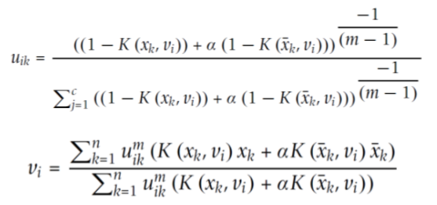
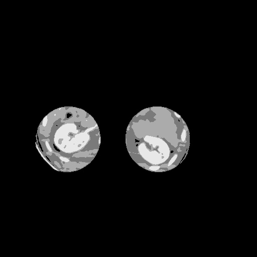
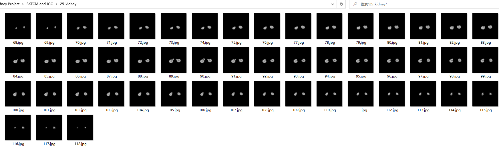

# Automatical-Kidney-Segmentation

## 1. Project Goal
The goal of the project is to automatically segment out all the kidneys of a CT scan set. Given the set number and the number of slices in which both of the kidneys appear and disappear, the project can start from the middle slice and automatically segment out the kidneys untill they disappear. The images for this experiment are all from seattle childrens' hospital. For the concerning of privacy, the whole dataset will not be showed in public.

## 2. Steps

### 2.1 Cavity Boundary Detection ###
Discard pixels outside the abdominal boundary, and use thresholding first, then using canny edge detector to find contours, find the largest contours, and fit ellipse of that contour.

### 2.2 Candidate Region Extraction ###
1. Allocate the spine landmarks.
2. Use heuristics about the relative location to find the elliptical candidate regions for left and right kidneys.

### 2.3 Spatial Kernelized Fuzzy C-Means to Cluster Pixels ###
Using spatial-constrained kernalized fuzzy c-means to cluster the pixels into several groups. This is a process of unsupervised learning, optimize the following objective function:

Use the alternative iterations of fuzzy partition matrix(U) and centroids(V) to minimize the objective function J:

Terminate if max(U_old - U) is less than 10e-7

Here is the result:

### 2.3 Locate the Kidney ###
For each side, consider the brightest cluster and choose the largest connected region (Exclusive), or consider pixels only brighter than the second largest centroid and choose the largest connected region (Inclusive). This region must be the kidney. Then we can do some modifications like dilation to fill the holes.

### 2.4 Automatically Segment in Series ###
1. After segment out the kidneys from the first slice, find the minimum bounding rectangle region of the kidney contours, and only consider this region in the next slice.
2. Do SKFCM in the next slice, find the kidney, crop the minimum bounding rectangle, and apply it to the next slice. (If cannot find the kidney region, use the kidney region of the previous slice)
3. Repeat the steps above, until all the slices are done.

## 3. Results
Here's a preview of one of our results in one set of CT scans.

## 4. Some Notes
1. Run `Rough Segmentation.py` to start the project. Change the input in the `main` function.
2. The name of input CT scans must be like `##.Seq##.Ser##.Img##`, `##` is the number. It should be *SetNum.SequenceNum.SeriesNum.ImageNum*. The format can be any image format but `.dcm` is preferred for further medical analysis.
